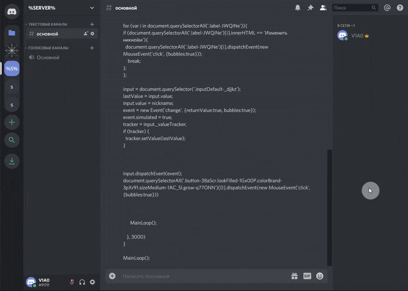

# discord-nickname-script

This script is updating your discord nickname on server every 3 seconds. Might be useful if admin changing your nickname time to time.

## How to run
Clone `discord-script-nickname-upd.js` and edit it

```javascript
nickname = "YOUR_NICKNAME";  // Enter your nickname here
im_admin = 1;                // 1 == YES,   0 == NO
```
Open https://discordapp.com/ and open right server

Open console (F12) and past the script, press Enter.
Don't close page while.

Example:


